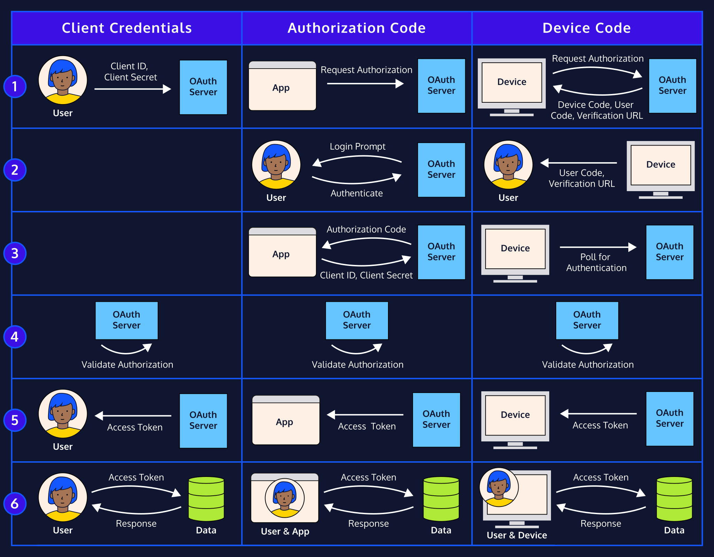
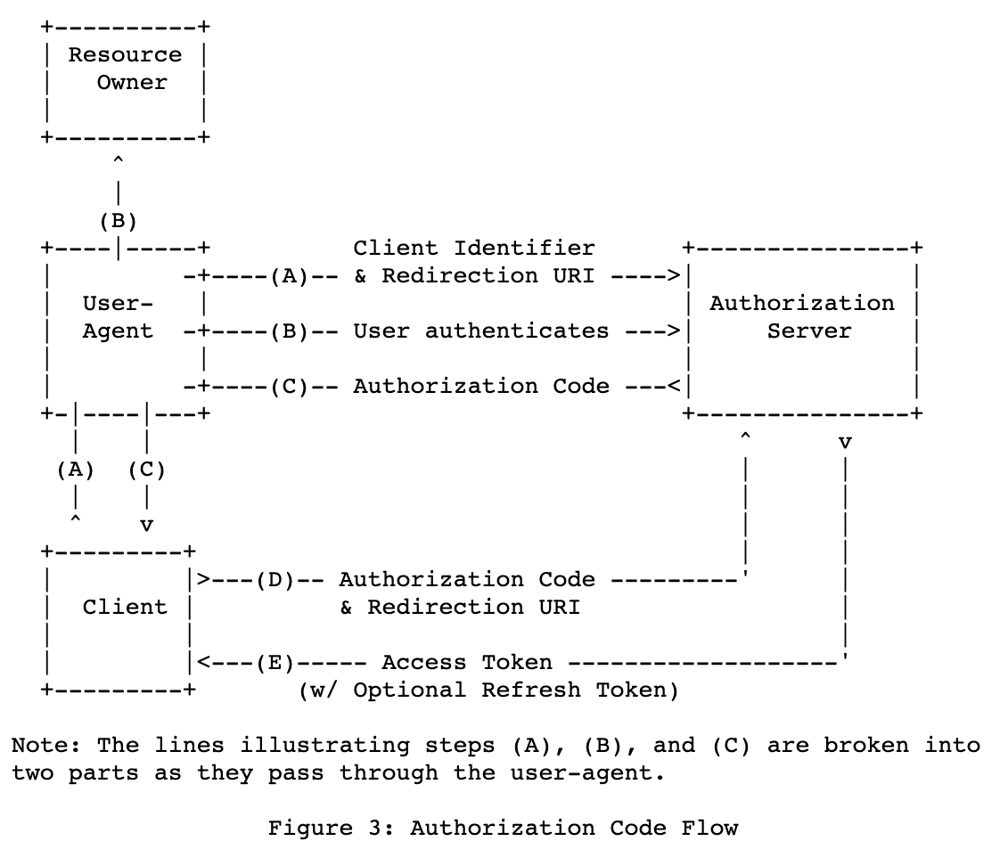
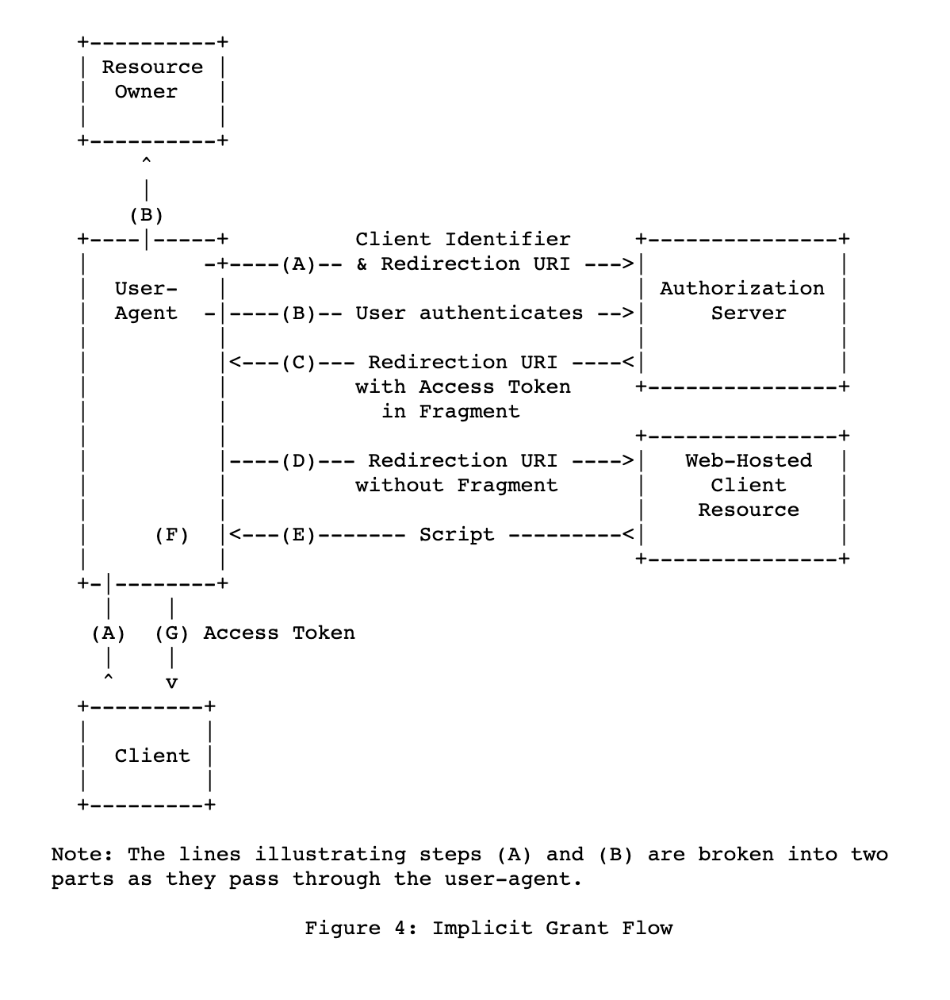
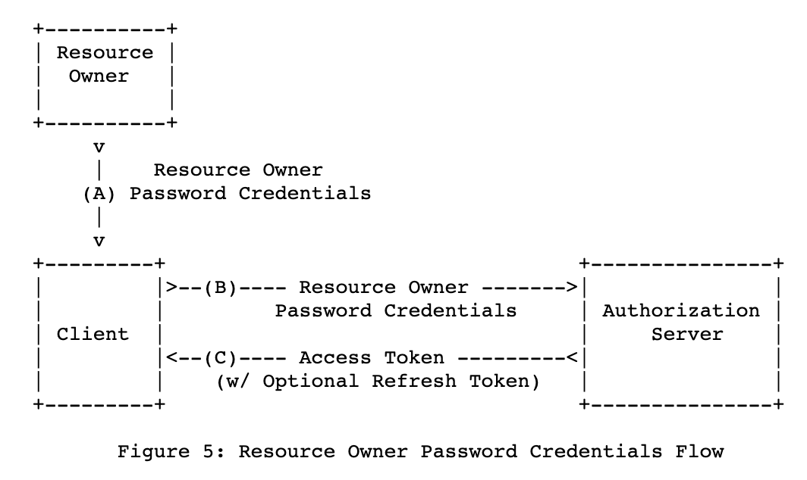
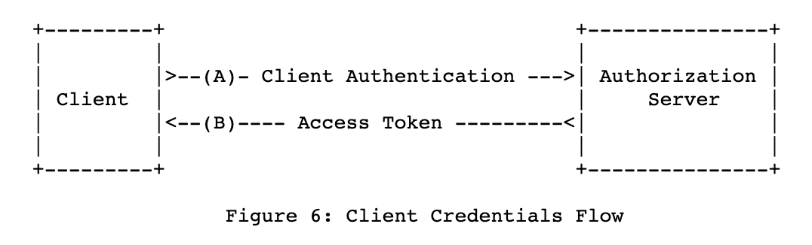

Auth Server Demo
================
heimdall 인증 서버와 istio 인가 동작 방식 이해하기.

OAuth2 개념
----------
> OAuth는 인터넷 사용자들이 비밀번호를 제공하지 않고 다른 웹사이트 상의 자신들의 정보에 대해 웹사이트나 애플리케이션의 접근 권한을 부여할 수 있는 공통적인 수단으로서 사용되는, **접근 위임을 위한 개방형 표준**이다.

Authentication(인증) : 사원증/방문증 발급  
Authorization(허가, 인가) : 사원증/방문증을 제시하고 회사 리소스에 접근. 사원증이냐 방문증이냐 종류에 따라 접근 가능 scope이 다르다.

#### roles
[oauth roles](https://datatracker.ietf.org/doc/html/rfc6749#section-1.1)  

`authorization server` : heimdall  
-> resource owner authentication(인증) 후 access-token 발급을 담당하는 서버  
`resource server` : dealibird  
-> access-token을 지참한 request에 대해 protected 리소스 응답 혹은 거절을 하는 서버  
`client`  
-> protected 리소스에 대한 요청을 보내는 쪽. app   
`resource owner` : end-user

#### grant_type
access token 발급 flow. Oauth2에는 여러가지 grant type이 있다. 예를 들면 이런 것들이 있음.
- Authorization code
- Implicit
- Resource Owner Password Credentials ✅
- Client Credentials ✅ 

(heimdall에서 사용하는 grant type 체크 표시)

출처: https://www.codecademy.com/learn/user-authentication-authorization-express/modules/oauth-2/cheatsheet






쿠버네티스 환경의 OAuth
-------------------


Rails Authorization Server
--------------------------

api 모드로 시작하기
```
rails new auth-server-demo -d mysql --api
```

필요한 gem 설치
```
gem 'devise'
gem 'doorkeeper'
gem 'doorkeeper-jwt'

bundle install
```

devise 설정
```
rails g devise:install
rails g devise user
```

초기 설정 및 마이그레이션 파일 생성하기
```
rails generate doorkeeper:install
rails generate doorkeeper:migration
```

각 파일 수정  
`create_doorkeeper_tables.rb` 마이그레이션 파일, 필요 없는 테이블 주석 처리    
`doorkeeper.rb` : 모드, grant_type 설정, jwt 토큰 설정 등  
`router.rb` : 필요 없는 컨트롤러 skip

마이그레이션으로 테이블 생성하기
```
rails db:create
rails db:migrate
```